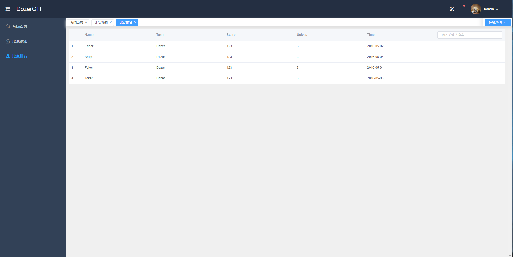
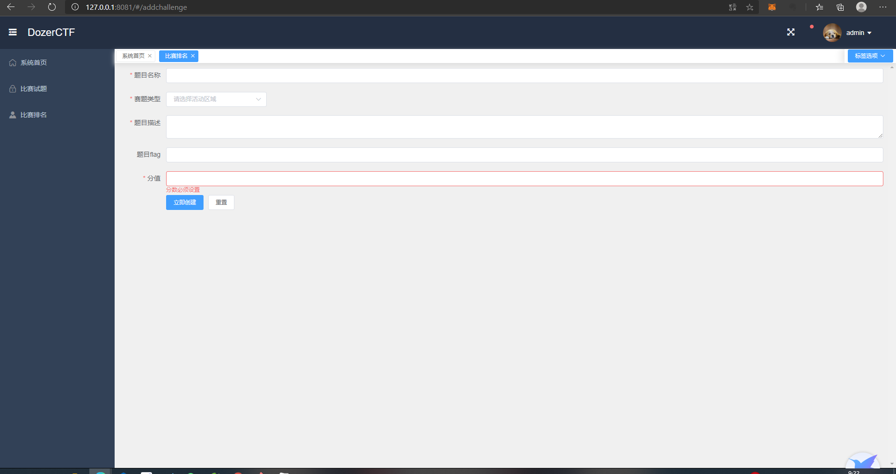

# S1eepc4t

> Dozer CTF Platform S1eepc4t

## 开发目的

不知道

## 技术栈

> SpringBoot+Mybatis+Vue

## 效果图

## 开发周期

> 随缘
>
> 2020/11/16 写了点前端
>
> 2020/11/18 写了点前端和后端
>
> 2020/11/25 写了一堆东西，看样子ctf平台快要写完了

## 开发人员

> Edgar